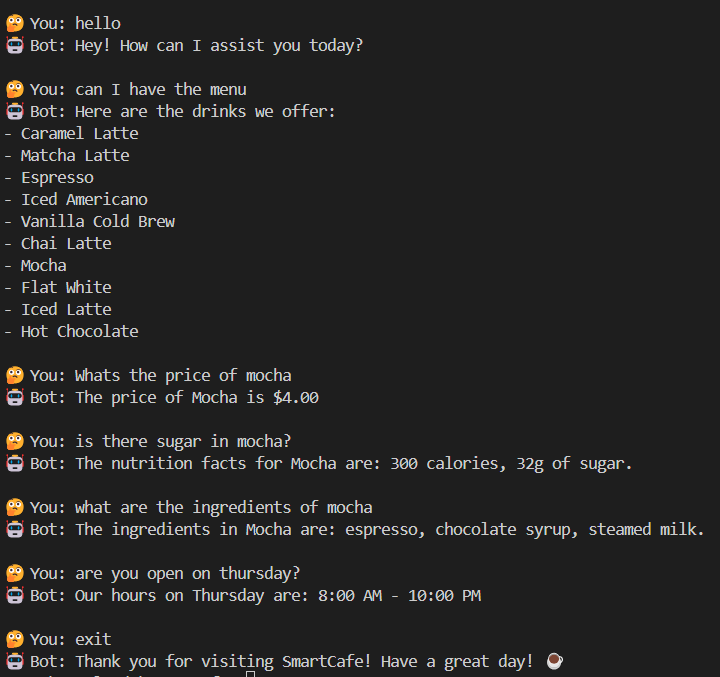

# SmartCafe Assistant 🍵

A smart chatbot assistant for cafe information built with Python using Object-Oriented Programming principles and multi-agent architecture.



## 🚀 Features

- **Menu Information**: Browse available drinks and their details
- **Price Queries**: Get pricing information for any drink
- **Ingredient Lists**: Find out what's in your favorite beverages
- **Nutritional Info**: Check calories and sugar content
- **Opening Hours**: Get cafe hours for any day of the week
- **Natural Language Processing**: Uses regex patterns for intent detection

## 🏗️ Program Structure
This SmartCafe Assistant is built using Object-Oriented Programming (OOP) principles with a multi-agent architecture consisting of two main classes:

### Core Components

**1. ChatBotAgent** (`ChatBotAgent.py`)
- Handles user interaction and conversation flow
- Uses regex pattern matching to detect user intents
- Routes user queries to the appropriate ResearchAgent methods
- Manages the main conversation loop and user interface

**2. ResearchAgent** (`ResearchAgent.py`)
- Loads and queries data from `cafe_data.json`
- Contains specialized methods for different types of information retrieval
- Handles all data processing and information extraction

**3. Supporting Files:**
- `main.py`: Entry point that initializes and starts the ChatBotAgent
- `random_responses.py`: Contains fallback responses for unrecognized queries
- `cafe_data.json`: Knowledge base containing menu, pricing, and hours information

## 🔧 Class and Method Roles
### ChatBotAgent Class:
- `__init__()`: Initializes the ResearchAgent dependency
- `greet_user()`: Displays welcome message and available options
- `get_pattern_count(user_input_lower, patterns)`: Get the count of the matching regex patterns for each category
- `detect_intent(user_input)`: Uses regex to identify what the user is asking about by checking the category with the max pattern count
- `route_response(user_input, intent)`: Directs queries to appropriate ResearchAgent methods
- `start_conversation()`: Main loop that handles continuous user interaction

### ResearchAgent Class:
- `__init__()`: Loads the cafe_data.json file into memory
- `list_drinks()`: Returns a formatted list of available beverages
- `list_opening_hours()`: Returns formatted opening hours for all days
- `get_price(user_input)`: Searches for drink prices based on user query
- `get_ingredients(user_input)`: Returns ingredient lists for specific drinks
- `get_nutrition(user_input)`: Provides nutritional information for drinks
- `get_hours(user_input)`: Returns opening hours for specific days

## 🧠 Regex Usage for Intent Detection
The ChatBotAgent uses regular expressions to detect user intents:

1. **Price Intent**: Patterns like 'price', 'cost', 'how much', '$'
   - Example: "How much does a latte cost?" → routes to `get_price()`

2. **Ingredients Intent**: Patterns like 'ingredient', 'made of', 'contains', 'what.*in'
   - Example: "What's in a mocha?" → routes to `get_ingredients()`

3. **Nutrition Intent**: Patterns like 'calorie', 'nutrition', 'sugar', 'healthy'
   - Example: "How many calories in hot chocolate?" → routes to `get_nutrition()`

4. **Hours Intent**: Patterns like 'hour', 'open', 'close', 'time', 'when'
   - Example: "When are you open on Friday?" → routes to `get_hours()`

5. **Menu Intent**: Patterns like 'menu', 'drink', 'beverage', 'what.*have', 'available'
   - Example: "What drinks do you have?" → routes to `list_drinks()`

6. **Exit Intent**: Patterns like 'exit', 'quit'
   - Example: "quit" → ends the conversation

The regex patterns use word boundaries (`\b`) and alternation (`|`) to match various ways users might phrase their questions naturally.

## 🚀 How to Run
### Prerequisites
- Python 3.6 or higher
- All project files in the same directory

### Running the Application
```bash
python main.py
```

### Usage
1. Run the command above
2. Follow the prompts to ask questions about the cafe
3. Type 'exit' or 'quit' to end the conversation

## 💬 Sample Interactions
```
🤔 You: "What's the price of a latte?"
🤖 Bot: Shows price information

🤔 You: "What ingredients are in a mocha?"
🤖 Bot: Lists ingredients

🤔 You: "How many calories in espresso?"
🤖 Bot: Shows nutritional info

🤔 You: "What are your hours on Saturday?"
🤖 Bot: Shows Saturday hours

🤔 You: "What drinks do you offer?"
🤖 Bot: Lists all available drinks
```

## 🏗️ Architecture Benefits
- **Separation of Concerns**: ChatBotAgent handles UI, ResearchAgent handles data
- **Composition**: ChatBotAgent depends on ResearchAgent for data operations
- **Modularity**: Each class has a specific responsibility
- **Extensibility**: Easy to add new intents or data sources
- **Maintainability**: Clean method structure and clear naming conventions

## 📁 Project Structure

```
SmartCafe-Assistant/
├── main.py                  # Entry point
├── ChatBotAgent.py          # Main conversation handler
├── ResearchAgent.py         # Data processing and queries
├── random_responses.py      # Fallback responses
├── cafe_data.json          # Knowledge base
├── ScreenshotSample.png    # Demo screenshot
└── README.md               # This file
```

## 🤝 Contributing

Feel free to fork this project and submit pull requests for any improvements!

## 📝 License

This project is open source and available under the [MIT License](LICENSE).